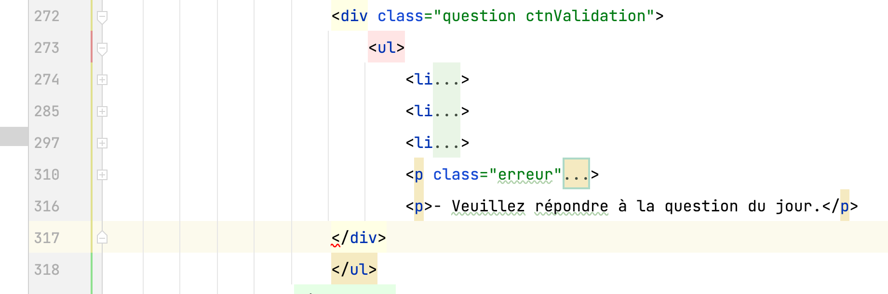
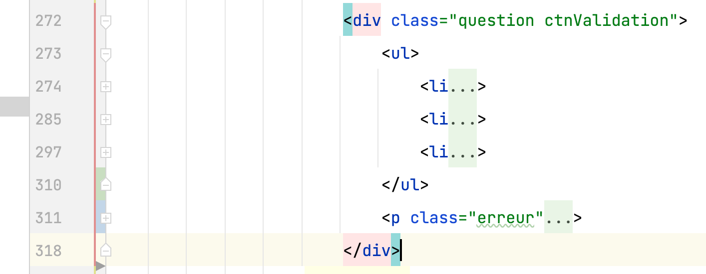
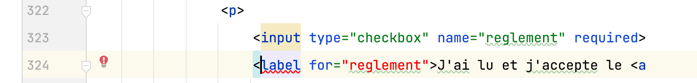

# Grille d'évaluation pour le TP3
## Structure, sémantique, accessibilité, API des formulaires HTML5
- [X] __Regrouper les éléments de formulaire de même nature__ (.95/1 point)  
  - Utiliser des `<fieldsets>`  
  - Faire des groupes d’`<option>`s dans une liste déroulante
- [X] __Étiqueter__ (.75/1 point)  
  - Étiqueter les groupes d’éléments de formulaire   
  - Nommer chaque groupe avec une `<legend>`  
  - Étiqueter un groupe d’`<option>`s d’une liste déroulante  
  - Étiqueter avec un `<label>` les champs de formulaire  
- [X] __Tester l'accessibilité__ (.5/1 point)  
    - Rendre (garder) le formulaire navigable au clavier  
  - Baliser avec précision les éléments de formulaire  
  - Bien choisir le type du `<input>`   
  - Code sémantique et valide pour l’ensemble du document  
- [X] __Ajouter des containtes de saisie__ (.95/1 point)  
  - Identifier par un attribut approprié les champs obligatoires du formulaire  
  - Ajouter des contraintes de saisie sur les champs de formulaire  

## Styles CSS
- [X] __Aligner les éléments de formulaire__ (.5/1 point)
    - Contrôler les espacements 
- [X] __Intégrer tous les contenus__  (.5/1 point)  
  - Selon les guides visuels (ou mieux !)
- [X] __Styler l’interactivité__  (0.5/1 point)
  - État focus, état checked des éléments de formulaires  
  - États des hyperliens (link, visited, hover, active)  
  - Styler les messages d’erreur
  - Utiliser des sprites CSS  
- [X] __Styler les boutons radio__  (0.5/1 point) 
  - en les gardant accessibles au clavier

## Méthodes de travail favorisant la collaboration
- [X] __Organiser et documenter la feuille de styles__  (0.75/1 point)
- [X] __Utiliser le contrôle des versions GIT__  (0.95/1 point)
    - Un minimum de 3 commits est attendu pour les étapes html, css, contrôle qualité finale

## Note et commentaires
 6.85 / 10 

- [Plusieurs erreurs html](images/erreurs-html.pdf)  
Beaucoup de ces erreurs sont liées à des structures déficientes comme celle-ci:    
  
À corriger comme ceci:  
  
- Attention à bien relier les étiquettes aux éléments de formulaire. Par exemple, ci-dessous, il manque un id:  

- Voir les autres commentaires dans le code.

## Barème
| Barème | sur 1 |
|--------|-------|
| A+     | 1     |
| A      | 0.95  |
| B+     | 0.9   |
| B      | 0.85  |
| C+     | 0.8   |
| C      | 0.75  |
| D      | 0.65  |
